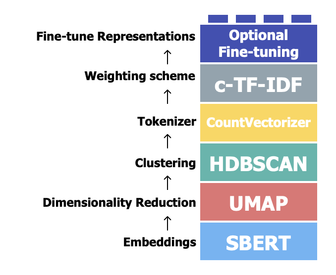
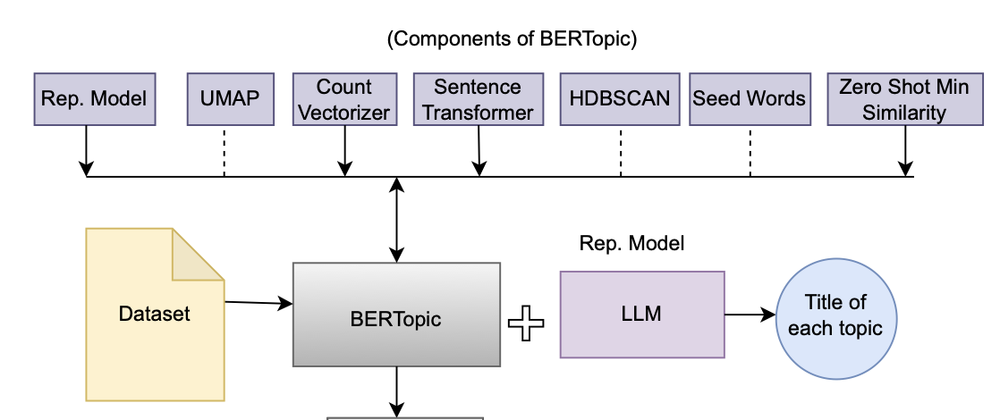
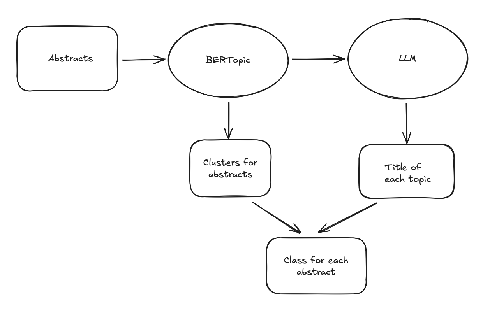
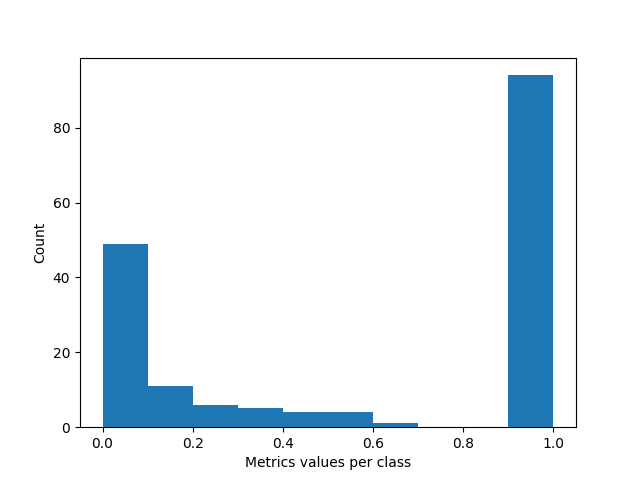

# Research Article Classification

### Objective
Research articles classification into an unknown number of categories.

### Dataset
Public arxiv dataset - https://www.kaggle.com/datasets/Cornell-University/arxiv

### Approaches and literature review
1. The first idea is that text classification is a well-established NLP problem. Classical NLP approaches are still powerful in many cases. The idea of these approaches is to obtain a vector representation of the text using Bag-of-Words or TF-IDF and then apply a linear classification model. Traditional approaches are reviewed, for example, in the article *“A Survey on Text Classification: From Traditional to Deep Learning”* by Qian Li et al. (2022).


2. The next approach is similar to the first one, but instead of BoW/TF-IDF we use BERT-based models for text representation. However, the basic BERT model is more focused on word embeddings, so it is recommended to use Sentence-BERT (SBERT). SBERT is a BERT model fine-tuned on sentence similarity tasks and can capture the overall meaning of sentences. An example of using SBERT for the classification of Wikipedia articles is provided in the article *“WC-SBERT: Zero-Shot Text Classification via SBERT with Self-Training for Wikipedia Categories”* by Te-Yu Chi et al. (2024).

3. We can build a classification model using the `categories` values in the arXiv dataset as targets. In general, each article can correspond to several categories. For example, `math.CO cond-mat.stat-mech math-ph math.MP math.PR` is the category for one article. As a result, we need to solve a multi-label classification problem with more than 75k unique labels. This task is solvable, but due to time constraints I decided to move forward with other approaches that focus more on LLM-based methods.

4. Let’s look at the classification of scientific articles in more detail. An article can correspond to different subjects and disciplines, such as Physics, Social Science, Medicine, Sports analytics, and so on. Each discipline can have fine-grained topics. For example, Physics includes Classical mechanics, Quantum physics, and other sub-topics, while Sports analytics might include Football, Basketball, etc. As a result, obtaining ground-truth labels is a difficult task, and many classes are absent from the labels in the arXiv dataset. For example, there is no specific label in `categories` for Sports analytics. Therefore, I decided to convert the supervised classification problem into an unsupervised one and to use the `categories` labels only for indirect evaluation of the unsupervised model.

5. There are many publications about text clustering with BERT/LLM models. For example:
   * *“Text clustering with LLM embeddings”* by Alina Petukhova et al. (2025),
   * *“Revolutionary text clustering: Investigating transfer learning capacity of SBERT models through pooling techniques”* by Yasin Ortakci (2024).

   The idea is simple: apply an LLM or SBERT to obtain text embeddings and then use a classical clustering algorithm. Since this is an unsupervised approach, metrics like the Silhouette Score and the Calinski–Harabasz Index are used for internal validation. The main issue of this approach is obtaining meaningful labels (descriptions) for each cluster.

6. Topic modeling might be the most suitable approach for this task. BERTopic, one of the most widely used approaches for topic modeling, was introduced in *“BERTopic: Neural topic modeling with a class-based TF-IDF procedure”* by Maarten Grootendorst (2022). The idea is very close to the clustering approach discussed above, but here we additionally use CountVectorizer and c-TF-IDF to identify the main words that characterize each cluster and even to identify representative texts/documents for each cluster. There are some pre-trained BERTopic models such as `BERTopic_ArXiv` and `BERTopic_Wikipedia`. I found `BERTopic_Wikipedia` more reliable for our task. There is also an option to train a custom BERTopic model on our own text corpus.

   BERTopic was published in 2022 and might look “old” compared to recent models. In 2024, a new model called BERTeley was released in the article *“Benchmarking topic models on scientific articles using BERTeley”* by Eric Changon (2024). However, I did not find many practical use cases for BERTeley, and it does not seem to have become very popular yet.

<p align="center">

</p>

7. BERTopic helps us identify the most important topic words for each cluster, but we still want to assign a human-readable label (title) to each topic. Here, I found the article *“LimTopic: LLM-based Topic Modeling and Text Summarization for Analyzing Scientific Articles’ Limitations”* particularly interesting. The authors aim to solve two problems: identifying a title for each topic and generating a topic summary. Their approache combines BERTopic and LLM where LLM is used to generate the title of each topic. In this project, I focus only on the first task - identifying a title for each topic using LimTopic. This is the final approach that was implemented in this project.
    
<p align="center">

</p>

8. One approach that stands out from what was discussed above is described in the article *“Text Clustering as Classification with LLMs”* by Chen Huan et al. (2025). The authors suggest using few-shot label descriptions to generate labels for all articles. This approach looks interesting, but it was not implemented here due to time constraints.

### Exploratory data analysis

The dataset `arxiv-metadata-oai-snapshot.json` is a large collection containing the following fields: `id`, `submitter`, `authors`, `title`, `comments`, `journal-ref`, `doi`, `report-no`, `categories`, `license`, `abstract`, `versions`, `update_date`, `authors_parsed`. This project is focused on using the `abstract` field for topic modeling. The `journal-ref` field could also be useful for identifying the topic of an article, but it was not used in this project.

Since the dataset is large, the file was read in chunks of 1000 rows. A full analysis of the entire dataset was not performed due to computational and time constraints.

**Abstact** The average length of an abstract is about 720 characters or 100 words. The following preprocessing steps were applied:

 * removing stop words
 * removing emails and HTML tags
 * removing all punctuation
 * removing documents with small length
 * lemmatization
 * tokenization (performed inside SBERT)

 **Categories** The number of unique categories is more than 75,000. The labels have a hierarchical structure. For example, the high-level category `math` has sub-categories such as `math.AP`, `math.NT`, `math.DG`, and so on. These categories are used for indirect validation of the topic modeling results.

### Model

The model includes two main components: **BERTopic** and an **LLM**.

- BERTopic clusters the corpus of abstracts and provides information about the top topic words for each cluster.  
- The list of top topic words is then passed to the LLM, which generates structured output with high-level and low-level labels for each cluster. Additionally, it is possible to include some representative texts/abstracts from each cluster in the LLM’s input context to improve label quality.

<p align="center">

</p>

### Validation

Validation was performed by comparing the original arXiv categories with the predicted clusters. The main idea is simple: if most abstracts in a predicted cluster belong to  a single original arXiv category, then this cluster is considered “good” and interpretable.

To quantify this, we use entropy, normalized to the \[0, 1\] range and then inverted so that:

- **1** → all abstracts in the cluster are concentrated in a single arXiv category  
- **0** → the categories within the cluster are perfectly uniform (i.e., completely mixed)

The validation plot is shown below. We observe that most predicted clusters are strongly concentrated in a single arXiv category, which is an indication that the model produces coherent clusters.

This metric is not perfect and has several limitations. However, finding an ideal metric for clustering is challenging. Here, I use this simple measure as a first, intuitive indicator of the model’s quality.

<p align="center">

</p>

### Hyperparameter tuning

Hyperparameter tuning was not performed in this project due to time and computational constraints. However, the main ideas for future tuning are outlined below:


1. **BERTopic configuration**  
   BERTopic provides an API for training a custom model. We can experiment with different combinations of BERTopic components (e.g., embedding models, dimensionality reduction, clustering algorithms) to obtain better results.

2. **LLM choice and sampling strategy**  
   We can try different LLMs to generate higher-quality topic titles. It also makes sense to run the LLM multiple times with different seeds and/or prompts, collect several candidate titles, and then select the most frequent or most consistent answer.

3. **Representative text selection**  
   It is important to improve how we select the representative text for each cluster. This should also be treated as part of hyperparameter tuning. For example, the representative text for each cluster could be generated or refined by a separate LLM.

4. **Config-driven experiments**  
   The codebase is prepared for hyperparameter tuning. In the `config` directory, we can define multiple YAML configuration files with different BERTopic and LLM parameters, making it easy to run and compare various reproducible experimental setups.

### Conclusion

There are many different ways to approach the task of article classification. In this project, only one possible solution and a relatively simple validation technique were presented. 

Ideally, we would first build a baseline model using classical NLP methods and then compare the impact of LLM-based approaches against this baseline. The choice of evaluation metrics for comparing different models ultimately depends on the specific business needs and use cases.

### How to run 
Please add initila data `arxiv-metadata-oai-snapshot.json` into `data` directory.

To run model training, Python version greater than 3.9 is required. Create a virtual environment using the following commands:

```
cd arxiv_classification
python3 -m venv venv
source venv/bin/activate
pip install -e .
python -m spacy download en_core_web_sm
```

To apply different configurations, you can use the `default.yaml` file in the `./src/config` directory.

To run the model, run: `python3 ./src/run_model.py`

All necessary data will be stored in the `./data` directory.

The `black` linter was used to maintain code style.